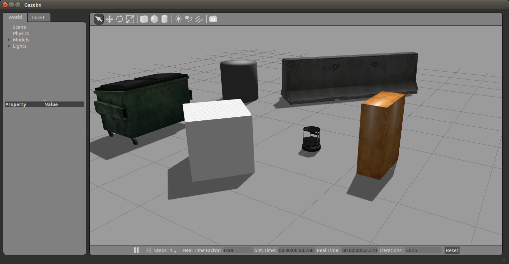

# Homework 

In this work, you should use OpenCV in Python to process the images coming through ROS from a simulated Turtlebot in the world. The goal is to detect edges of each obstacle in the world.

An edge should be identified as illustred below:


In order to run the world, you should have the `Turtlebot` installed in your computer. Having `Turtlebot` installed, run:

```
$ roslaunch turtlebot_gazebo turtlebot_world.launch
```

Launching the world should open Gazebo with an image similar to the screen below:




Next step consists of creating a script to subscribe in a ROS topic to access the camera data and apply an edge detector algorithm. As result, a window containing the edges has to be presented as illustrated in images below (the input frames from camera and the output frames from edge detection).


When running edge detector, you can control Turtlebot with `teleop`, by running:

```
$ roslaunch turtlebot_teleop keyboard_teleop.launch
```

After implementing the script, you should try several values of threshold and check the results.
