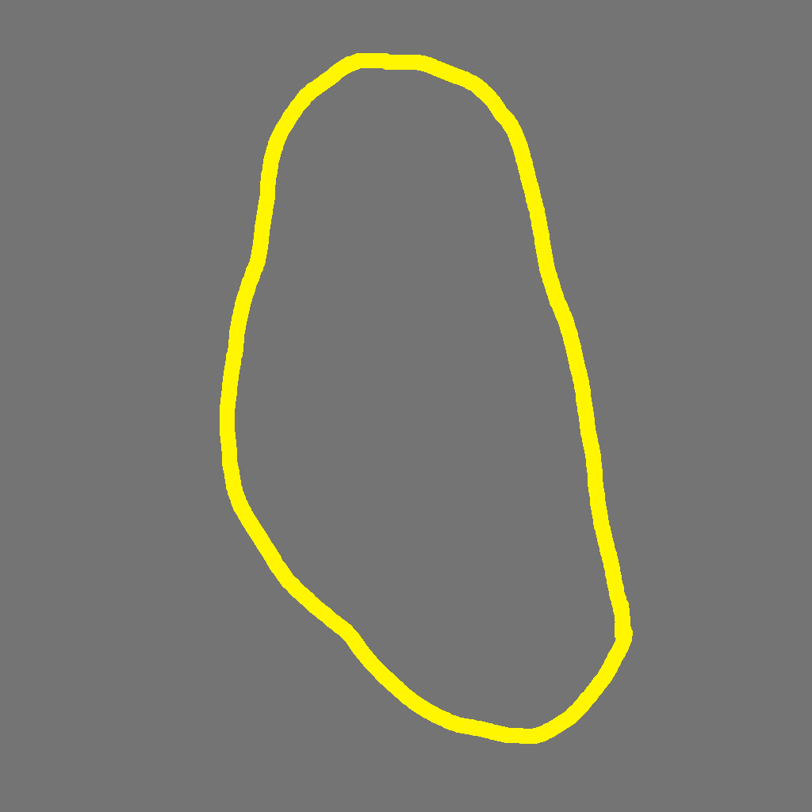
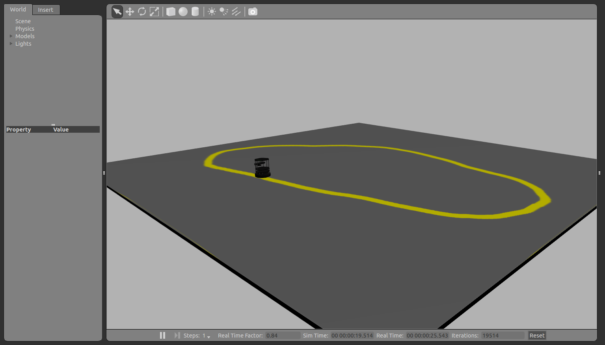
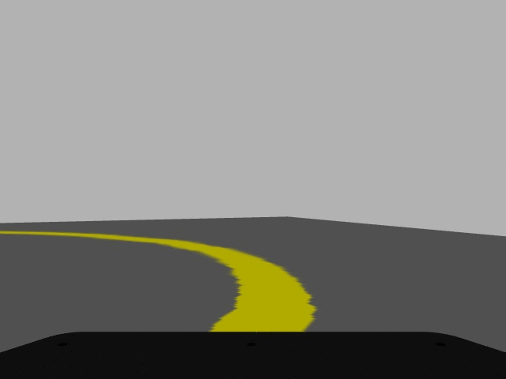

# Exercise - Line tracking 

In this work, you should use OpenCV in Python to process the images coming through ROS from a simulated Turtlebot in the world. The goal is to detect the location of the target line in the Turtlebot's camera and follow it around the course. 

The course is illustrated in the Figure below:



In order to run the world, add the `tracking` folder to your Catkin workspace and compile it with `catkin_make`. Having the world compiled in the workspace, run:

```
$ roslaunch trackingbot tracking.launch
```

Launching the world should open Gazebo with an image similar to the screen below:



Next step consists in creating a script to subscribe and publish ROS topics. To check whether the robot is following the line, I suggest you to show the image from the `camera/rgb/image_raw` topic in a window, such as:



After implementing the script, run and check if the robot is following the line correctly. I suggest you in the first trials to keep the linear velocity a bit low (about 0.5), thus, the robot would not get out of the tracking.

## Notes

In order to work with ROS images and OpenCV you need to have `cv_bridge` and OpenCV packages installed. `cv_bridge` comes with ROS Desktop installation and OpenCV can be installed by `apt` package as:

```
$ sudo apt-get install libopencv-dev python-opencv
```

Or it can be installed from source using the [Github](https://github.com/opencv/opencv) code.
